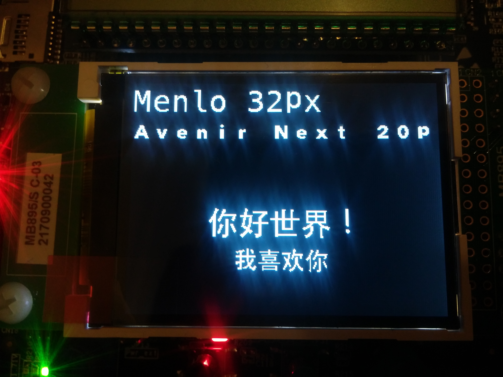

# TFT-CustomFonts

	STM32L073Z_EVAL

> Use custom fonts on the TFT LCD display.  
>
> This uses custom font header files as generated by my [STM32-LCD_Font_Generator](https://github.com/zst-embedded/STM32-LCD_Font_Generator)
>
> Chinese fonts are generated with the charset: [chinese-hello-world.txt](chinese-hello-world.txt)

	---
	
	IDE:
	- SW4STM32

---

## Initial Setup Notes

#### STM32CubeMX

    SPI1: Full-Duplex Master

    Clock: 32MHz (PLLCLK x4)

#### [BSP Drivers](../../additional/setup.md)

STM32L073Z_EVAL BSP drivers are used for the TFT LCD display.

- `"stm32l073z_eval.h"`
- `"stm32l073z_eval_lcd.h"`

STM32L073Z_EVAL BSP LCD drivers are modified to support external fonts as [documented here](https://github.com/zst-embedded/STM32-LCD_Font_Generator).
